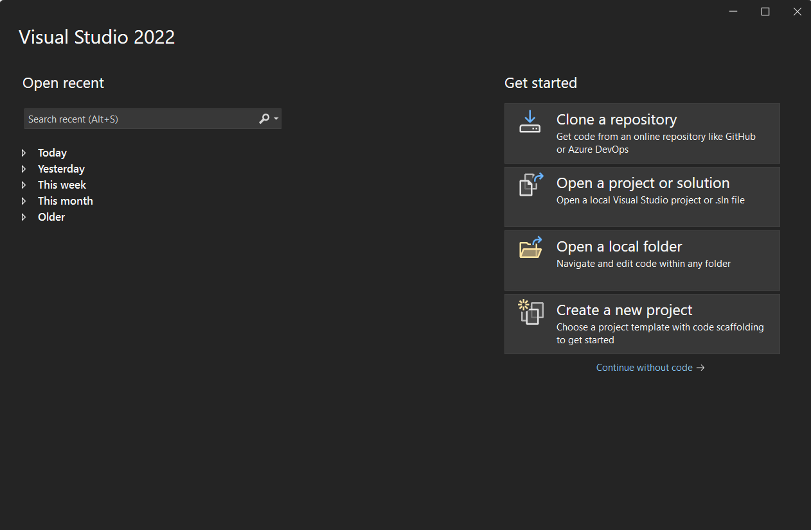
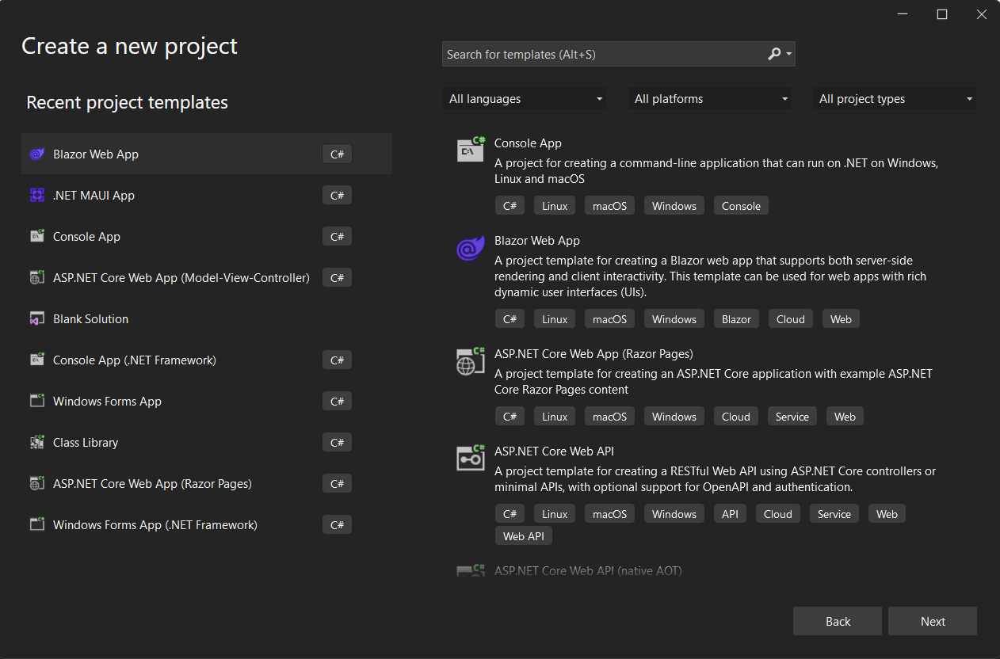
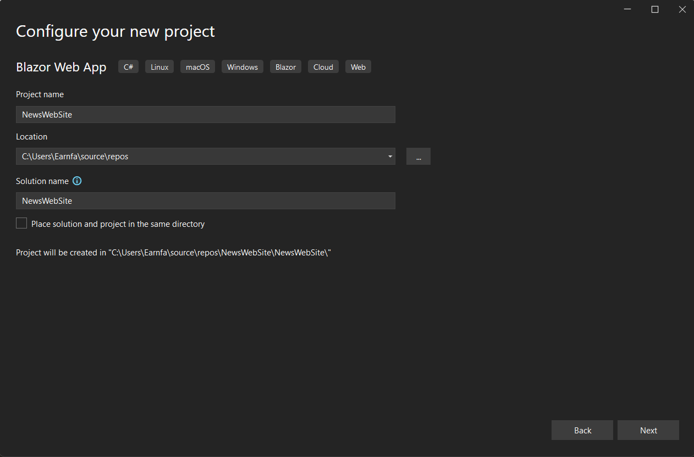
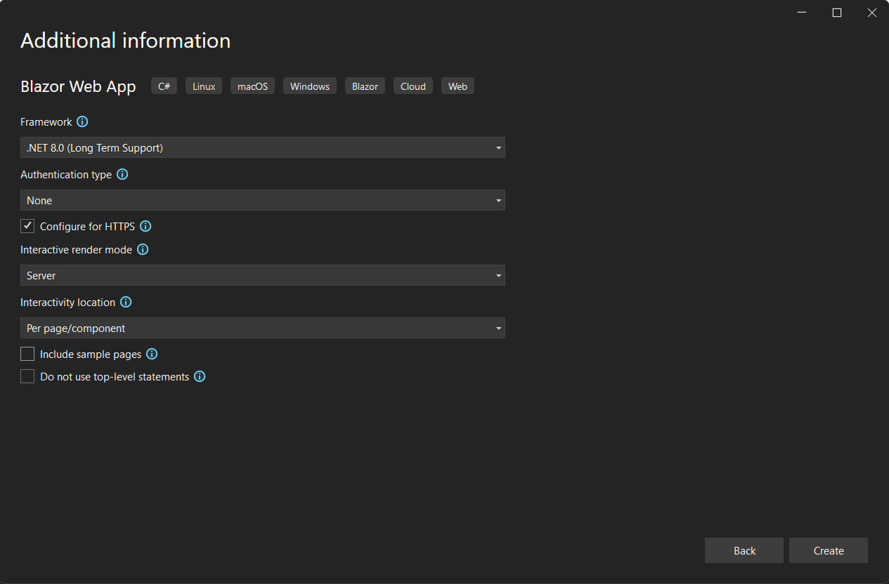
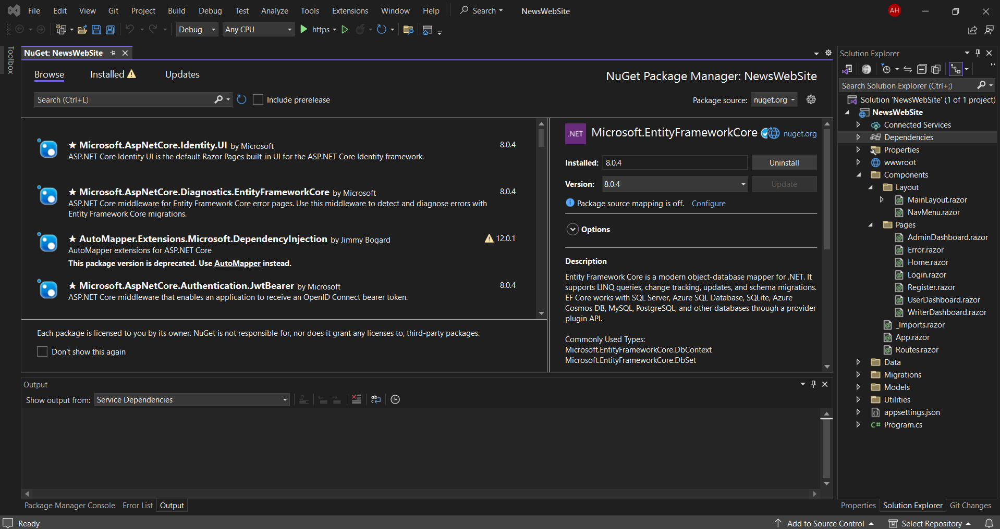

# Securing Your .NET 8 Blazor Interactive Server : Policy-Based Authorization with Identity Manager

## step 1 : create project

1 - open visual studio and hit create a new project button <br>

2 - select blazor web server then click next <br>

3 - name the project NewsWebSite and hit next button <br>

4 - select dotnet 8 and uncheck include sample pages then hit the create button <br>


## step 2 : Add Package refrences

1 - right click on dependencies in solution explorer <br>
2 - select manage nuget Packages <br>
3 - switch to browes tab <br>

4 - write these libreries in search bar:
`Microsoft.EntityFrameworkCore` - `Microsoft.EntityFrameworkCore.SqlServer` - `Microsoft.EntityFrameworkCore.Tools` - `Microsoft.AspNetCore.Identity.EntityFrameworkCore` <br>
5 - install each one with version 8.0.4 <br>

## step 3 : create database and models

1 - create `Models` and `Data` folders <br>
2 - in `Models` folder create `LoginModel.cs` and `RegisterModel.cs` class files <br>
3 - in `LoginModel.cs` file write these codes :  <br>
```csharp
using System.ComponentModel.DataAnnotations;

namespace NewsWebSite.Models
{
    public class LoginModel
    {
        [Required]
        [EmailAddress]
        public string Email { get; set; } = "";
        [Required]
        [DataType(DataType.Password)]
        public string Password { get; set; } = "";
    }
}

```
4 - in `RegisterModel.cs` file write these codes :  <br>
```csharp
using System.ComponentModel.DataAnnotations;

namespace NewsWebSite.Models
{
    public class RegisterModel : LoginModel
    {

        [DataType(DataType.Password)]
        [Display(Name = "Confirm Password")]
        [Compare("Password")]
        public string ConfirmPassword { get; set; } = "";
    }
}
```
5 - in `Data` folder please create `NewsDbContext.cs` class file <br>
6 - in `NewsDbContext.cs` file write these codes : <br>
```csharp
using Microsoft.AspNetCore.Identity.EntityFrameworkCore;
using Microsoft.AspNetCore.Identity;
using Microsoft.EntityFrameworkCore;

namespace NewsWebSite.Data
{
    public class NewsDbContext(DbContextOptions<NewsDbContext> options) : IdentityDbContext<IdentityUser>(options)
    {
    }
}

```

## step 4 : create utility classes
1 - create `Utilities` folder   <br>
2 - in `Utilities` folder please create `IdentityRevalidatingAuthStateProvider.cs` class file and add these codes to it :  <br>
```csharp
using Microsoft.AspNetCore.Components.Authorization;
using Microsoft.AspNetCore.Components.Server;
using Microsoft.AspNetCore.Identity;
using Microsoft.Extensions.Options;
using System.Security.Claims;

namespace NewsWebSite.Utilities
{
    public sealed class IdentityRevalidatingAuthStateProvider(ILoggerFactory loggerFactory, IServiceScopeFactory scopeFactory, IOptions<IdentityOptions> options) : RevalidatingServerAuthenticationStateProvider(loggerFactory)
    {
        protected override TimeSpan RevalidationInterval => TimeSpan.FromSeconds(20);

        protected override async Task<bool> ValidateAuthenticationStateAsync(AuthenticationState authenticationState, CancellationToken cancellationToken)
        {
            await using var scope = scopeFactory.CreateAsyncScope();
            var userManager = scope.ServiceProvider.GetRequiredService<UserManager<IdentityUser>>();
            return await ValidateSecurityStampAsync(userManager, authenticationState.User);
        }

        private async Task<bool> ValidateSecurityStampAsync(UserManager<IdentityUser> userManager, ClaimsPrincipal principal)
        {
            var user = await userManager.GetUserAsync(principal);
            if (user is null)
                return false;
            else if (!userManager.SupportsUserSecurityStamp)
                return true;
            else
            {
                var pS = principal.FindFirstValue(options.Value.ClaimsIdentity.SecurityStampClaimType);
                var uS = await userManager.GetSecurityStampAsync(user);
                return pS == uS;
            }
        }
    }
}

```
3 - in `Utilities` folder please create `SignOutEndpoint.cs` class file and add these codes to it :  <br>
```csharp
using Microsoft.AspNetCore.Http.HttpResults;
using Microsoft.AspNetCore.Identity;
using System.Security.Claims;

namespace NewsWebSite.Utilities
{
    public static class SignOutEndpoint
    {
        public static IEndpointConventionBuilder MapSignOutEndpoint(this IEndpointRouteBuilder builder)
        {
            ArgumentNullException.ThrowIfNull(builder);
            var accountGroup = builder.MapGroup("/Account");
            return accountGroup.MapPost("/Logout", Manage);
        }

        private static async Task<RedirectHttpResult> Manage(ClaimsPrincipal user, SignInManager<IdentityUser> signInManager)
        {
            await signInManager.SignOutAsync();
            return TypedResults.LocalRedirect("/");
        }
    }
}

```

## step 5 : update and configure some files

1 - moddify your `appsettings.json` file with these codes : <br>
```json
{
  "ConnectionStrings": {
    "Default": "Server=(localdb)\\mssqllocaldb; Database=NewsWebSiteDB; Trusted_Connection=true; Trust Server Certificate=true"
  },
  "Logging": {
    "LogLevel": {
      "Default": "Information",
      "Microsoft.AspNetCore": "Warning"
    }
  },
  "AllowedHosts": "*"
}
```
2 - moddify your `Program.cs` file with these codes : <br>
```csharp
using Microsoft.AspNetCore.Components.Authorization;
using Microsoft.AspNetCore.Identity;
using Microsoft.EntityFrameworkCore;
using NewsWebSite.Components;
using NewsWebSite.Data;
using NewsWebSite.Utilities;

var builder = WebApplication.CreateBuilder(args);

// Add services to the container.
builder.Services.AddRazorComponents()
    .AddInteractiveServerComponents();

builder.Services.AddCascadingAuthenticationState();
builder.Services.AddScoped<AuthenticationStateProvider, IdentityRevalidatingAuthStateProvider>();
builder.Services.AddDbContext<NewsDbContext>(o => o.UseSqlServer(builder.Configuration.GetConnectionString("Default")));
builder.Services.AddAuthentication(o =>
{
    o.DefaultScheme = IdentityConstants.ApplicationScheme;
    o.DefaultSignInScheme = IdentityConstants.ExternalScheme;
}).AddIdentityCookies();
builder.Services.AddIdentityCore<IdentityUser>()
    .AddEntityFrameworkStores<NewsDbContext>()
    .AddSignInManager()
    .AddDefaultTokenProviders();
builder.Services.AddAuthorizationBuilder()
    .AddPolicy("AdminPolicy", p =>
    {
        p.RequireAuthenticatedUser();
        p.RequireRole("admin", "writer");
    });
var app = builder.Build();

// Configure the HTTP request pipeline.
if (!app.Environment.IsDevelopment())
{
    app.UseExceptionHandler("/Error", createScopeForErrors: true);
    // The default HSTS value is 30 days. You may want to change this for production scenarios, see https://aka.ms/aspnetcore-hsts.
    app.UseHsts();
}

app.UseHttpsRedirection();

app.UseStaticFiles();
app.UseAntiforgery();

app.MapRazorComponents<App>()
    .AddInteractiveServerRenderMode();
app.MapSignOutEndpoint();
app.Run();
```
3 - open nuget package manager console and type `Add-Migration InitialCreate` then hit enter <br>
4 - after Migrations created , you should type `Update-Database` command and hit enter in package manager console <br>
5 - open `Routes.razor` file in `Components` folder and moddify it with these codes : <br>
```razor
@using Microsoft.AspNetCore.Components.Authorization;
<Router AppAssembly="typeof(Program).Assembly">
    <Found Context="routeData">
        <AuthorizeRouteView RouteData="routeData" DefaultLayout="typeof(Layout.MainLayout)" >
            <Authorizing>
                <h2>Please Wait...</h2>
            </Authorizing>
        </AuthorizeRouteView>
        <FocusOnNavigate RouteData="routeData" Selector="h1" />
    </Found>
</Router>
```
6 - open `_Imports.razor` file in `Components` folder and moddify it with these codes : <br>
```razor
@using System.Net.Http
@using System.Net.Http.Json
@using Microsoft.AspNetCore.Identity
@using System.Security.Claims
@using Microsoft.AspNetCore.Components.Forms
@using Microsoft.AspNetCore.Components.Authorization
@using Microsoft.AspNetCore.Authorization
@using Microsoft.AspNetCore.Components.Routing
@using Microsoft.AspNetCore.Components.Web
@using static Microsoft.AspNetCore.Components.Web.RenderMode
@using Microsoft.AspNetCore.Components.Web.Virtualization
@using Microsoft.JSInterop
@using NewsWebSite
@using NewsWebSite.Utilities
@using NewsWebSite.Models
@using NewsWebSite.Data
@using NewsWebSite.Components
```
7 - open your `MainLayout.razor` page in `Components/Layout` folder and moddify it with these codes: <br>
```html
@inherits LayoutComponentBase

<div class="page">
    <div class="sidebar">
        <NavMenu />
    </div>

    <main>
        <div class="top-row px-4">
            <a href="about">About</a>
        </div>

        <article class="content px-4">
            @Body
        </article>
    </main>
</div>

<div id="blazor-error-ui">
    An unhandled error has occurred.
    <a href="" class="reload">Reload</a>
    <a class="dismiss">🗙</a>
</div>
```
8 - open your `MainLayout.razor.css` page in `Components/Layout` folder and moddify it with these codes: <br>
```css
.navbar-toggler {
    appearance: none;
    cursor: pointer;
    width: 3.5rem;
    height: 2.5rem;
    color: white;
    position: absolute;
    top: 0.5rem;
    right: 1rem;
    border: 1px solid rgba(255, 255, 255, 0.1);
    background: url("data:image/svg+xml,%3csvg xmlns='http://www.w3.org/2000/svg' viewBox='0 0 30 30'%3e%3cpath stroke='rgba%28255, 255, 255, 0.55%29' stroke-linecap='round' stroke-miterlimit='10' stroke-width='2' d='M4 7h22M4 15h22M4 23h22'/%3e%3c/svg%3e") no-repeat center/1.75rem rgba(255, 255, 255, 0.1);
}

.navbar-toggler:checked {
    background-color: rgba(255, 255, 255, 0.5);
}

.top-row {
    height: 3.5rem;
    background-color: rgba(0,0,0,0.4);
}

.navbar-brand {
    font-size: 1.1rem;
}

.bi {
    display: inline-block;
    position: relative;
    width: 1.25rem;
    height: 1.25rem;
    margin-right: 0.75rem;
    top: -1px;
    background-size: cover;
}

.bi-house-door-fill-nav-menu {
    background-image: url("data:image/svg+xml,%3Csvg xmlns='http://www.w3.org/2000/svg' width='16' height='16' fill='white' class='bi bi-house-door-fill' viewBox='0 0 16 16'%3E%3Cpath d='M6.5 14.5v-3.505c0-.245.25-.495.5-.495h2c.25 0 .5.25.5.5v3.5a.5.5 0 0 0 .5.5h4a.5.5 0 0 0 .5-.5v-7a.5.5 0 0 0-.146-.354L13 5.793V2.5a.5.5 0 0 0-.5-.5h-1a.5.5 0 0 0-.5.5v1.293L8.354 1.146a.5.5 0 0 0-.708 0l-6 6A.5.5 0 0 0 1.5 7.5v7a.5.5 0 0 0 .5.5h4a.5.5 0 0 0 .5-.5Z'/%3E%3C/svg%3E");
}

.bi-plus-square-fill-nav-menu {
    background-image: url("data:image/svg+xml,%3Csvg xmlns='http://www.w3.org/2000/svg' width='16' height='16' fill='white' class='bi bi-plus-square-fill' viewBox='0 0 16 16'%3E%3Cpath d='M2 0a2 2 0 0 0-2 2v12a2 2 0 0 0 2 2h12a2 2 0 0 0 2-2V2a2 2 0 0 0-2-2H2zm6.5 4.5v3h3a.5.5 0 0 1 0 1h-3v3a.5.5 0 0 1-1 0v-3h-3a.5.5 0 0 1 0-1h3v-3a.5.5 0 0 1 1 0z'/%3E%3C/svg%3E");
}

.bi-list-nested-nav-menu {
    background-image: url("data:image/svg+xml,%3Csvg xmlns='http://www.w3.org/2000/svg' width='16' height='16' fill='white' class='bi bi-list-nested' viewBox='0 0 16 16'%3E%3Cpath fill-rule='evenodd' d='M4.5 11.5A.5.5 0 0 1 5 11h10a.5.5 0 0 1 0 1H5a.5.5 0 0 1-.5-.5zm-2-4A.5.5 0 0 1 3 7h10a.5.5 0 0 1 0 1H3a.5.5 0 0 1-.5-.5zm-2-4A.5.5 0 0 1 1 3h10a.5.5 0 0 1 0 1H1a.5.5 0 0 1-.5-.5z'/%3E%3C/svg%3E");
}

.nav-item {
    font-size: 0.9rem;
    padding-bottom: 0.5rem;
}

    .nav-item:first-of-type {
        padding-top: 1rem;
    }

    .nav-item:last-of-type {
        padding-bottom: 1rem;
    }

    .nav-item ::deep .nav-link {
        color: #d7d7d7;
        background: none;
        border: none;
        border-radius: 4px;
        height: 3rem;
        display: flex;
        align-items: center;
        line-height: 3rem;
        width: 100%;
    }

.nav-item ::deep a.active {
    background-color: rgba(255,255,255,0.37);
    color: white;
}

.nav-item ::deep .nav-link:hover {
    background-color: rgba(255,255,255,0.1);
    color: white;
}

.nav-scrollable {
    display: none;
}

.navbar-toggler:checked ~ .nav-scrollable {
    display: block;
}

@media (min-width: 641px) {
    .navbar-toggler {
        display: none;
    }

    .nav-scrollable {
        /* Never collapse the sidebar for wide screens */
        display: block;

        /* Allow sidebar to scroll for tall menus */
        height: calc(100vh - 3.5rem);
        overflow-y: auto;
    }
}

```
9 - open your `Home.razor` page and moddify codes like this : <br>
```html
@page "/"
<PageTitle>Home</PageTitle>

<h1>Top News</h1>

<h2>Welcome to your News WebSite.</h2>

<h4>everything in your hands, just search about it!</h4>
```

## step 6 : Add Pages

1 - in `Components/Pages` add `Register.razor` razor file and write these codes for it : <br>
```html
@page "/Account/Register";
@inject UserManager<IdentityUser> userManager
@inject NavigationManager navManager

<PageTitle>Registeration</PageTitle>

<h1>Please Register</h1>
<div class="row">
    <div class="col-md-4">
        <EditForm Model="RegisterDto" method="post" OnValidSubmit="RegisterUser" FormName="registerForm" Enhance>
            <DataAnnotationsValidator />
            <h2>Create A New Account</h2>
            <hr />
            <ValidationSummary class="text-danger" role="alert" />

            <div class="form-floating mb-3">
                <InputText @bind-Value="RegisterDto.Email" class="form-control" type="email" autocomplete="username" aria-required="true" placeholder="name@example.com" />
                <label for="email" class="form-label">Email</label>
                <ValidationMessage For="()=> RegisterDto.Email" class="text-danger" />
            </div>
            <div class="form-floating mb-3">
                <InputText @bind-Value="RegisterDto.Password" class="form-control" type="password" autocomplete="current-password" aria-required="true" placeholder="password" />
                <label for="password" class="form-label">Password</label>
                <ValidationMessage For="()=> RegisterDto.Password" class="text-danger" />
            </div>
            <div class="form-floating mb-3">
                <InputText @bind-Value="RegisterDto.ConfirmPassword" type="password" class="form-control" autocomplete="current-password" aria-required="true" placeholder="password" />
                <label for="confirm-password" class="form-label">ConfirmPassword</label>
                <ValidationMessage For="()=> RegisterDto.ConfirmPassword" class="text-danger" />
            </div>
            <div class="form-floating mb-3">
                <InputText @bind-Value="RegisterDto.Role" class="form-control" type="Role" autocomplete="username" aria-required="true" placeholder="user" />
                <ValidationMessage For="()=> RegisterDto.Role" class="text-danger" />
            </div>
            <div>
                <button type="submit" class="w-100 btn btn-lg btn-primary">Create Account</button>
            </div>
            <div>
                <p class="alert-danger">
                    @Error
                </p>
            </div>
        </EditForm>
    </div>
</div>

@code {
    [SupplyParameterFromForm]
    private RegisterModel RegisterDto { get; set; } = new();
    private string Error = "";
    public async Task RegisterUser()
    {
        var newUser = new IdentityUser()
        {
            UserName = RegisterDto.Email,
            Email = RegisterDto.Email,
            PasswordHash = RegisterDto.Password
        };

        var findUser = await userManager.FindByEmailAsync(RegisterDto.Email);
        if (findUser is not null) return;
        var result = await userManager.CreateAsync(newUser, RegisterDto.Password);
        if (result.Succeeded)
        {
            //remove new(ClaimTypes.Role, "admin") if you just want simple user
            List<Claim> claims = new()
            {
                new(ClaimTypes.Name, RegisterDto.Email),
                new(ClaimTypes.Email, RegisterDto.Email)
            };
            switch (RegisterDto.Role.ToLower())
            {
                case "admin":
                    claims.Add(new(ClaimTypes.Role, "admin"));
                    break;
                case "writer":
                    claims.Add(new(ClaimTypes.Role, "writer"));
                    break;
                default:
                    break;
            }
            await userManager.AddClaimsAsync(newUser!, claims);
            navManager.NavigateTo("/account/login", true);
        }
        else
        {
            Error = "ERRORS : \n";
            foreach (var e in result.Errors)
            {
                Error += $"{e.Code} : {e.Description}\n";
            }

        }
    }

}

```
2 - in `Components/Pages` add `Login.razor` razor file and write these codes for it : <br>
```html
@page "/Account/LoginPage"
@inject UserManager<IdentityUser> userManager
@inject SignInManager<IdentityUser> signInManager
@inject NavigationManager navManager
<PageTitle>Log in</PageTitle>

<h1>Please Login</h1>
<div class="row">
    <div class="col-md-4">
        <section>
            <EditForm Model="LoginDto" method="post" OnValidSubmit="LoginUser" FormName="loginForm" Enhance>
                <DataAnnotationsValidator />
                <hr />
                <ValidationSummary class="text-danger" role="alert" />

                <div class="form-floating mb-3">
                    <InputText @bind-Value="LoginDto.Email" class="form-control" autocomplete="username" aria-required="true" placeholder="name@example.com" />
                    <label for="email" class="form-label">Email</label>
                    <ValidationMessage For="()=> LoginDto.Email" class="text-danger" />
                </div>
                <div class="form-floating mb-3">
                    <InputText @bind-Value="LoginDto.Password" class="form-control" autocomplete="current-password" aria-required="true" placeholder="password" type="password" />
                    <label for="password" class="form-label">Password</label>
                    <ValidationMessage For="()=> LoginDto.Password" class="text-danger" />
                </div>
                <div>
                    <button type="submit" class="w-100 btn btn-lg btn-primary">Login</button>
                </div>
            </EditForm>
        </section>
    </div>
</div>

@code {
    [SupplyParameterFromForm]
    private LoginModel LoginDto { get; set; } = new();
    public async Task LoginUser()
    {

        var findUser = await userManager.FindByEmailAsync(LoginDto.Email);
        if (findUser is null) return;
        var result = await signInManager.CheckPasswordSignInAsync(findUser, LoginDto.Password, false);
        if (!result.Succeeded) return;
        var response = await signInManager.PasswordSignInAsync(findUser, LoginDto.Password, false, false);
        if (response.Succeeded)
        {
            navManager.NavigateTo("/", true);
        }
        else
        {
            //show error
        }
    }
}

```
3 - in `Components/Pages` add `WriterDashboard.razor` razor file and write these codes for it : <br>
```html
@page "/writer"
@attribute [Authorize(Roles = "writer")]

<h3>WriterDashboard</h3>

```
4 - in `Components/Pages` add `AdminDashboard.razor` razor file and write these codes for it : <br>
```html
@page "/admin"
@attribute [Authorize(Roles = "admin")]

<h3>AdminDashboard</h3>

```
5 - in `Components/Pages` add `UserDashboard.razor` razor file and write these codes for it : <br>
```html
@page "/user"
@attribute [Authorize]

<h3>UserDashboard</h3>

```
6 - in `Components/Layer` add `NavMenu.razor` razor file and write these codes for it : <br>
```html
<div class="top-row ps-3 navbar navbar-dark">
    <div class="container-fluid">
        <a class="navbar-brand" href="">PolicyAutorization</a>
    </div>
</div>

<input type="checkbox" title="Navigation menu" class="navbar-toggler" />

<div class="nav-scrollable" onclick="document.querySelector('.navbar-toggler').click()">
    <nav class="flex-column">
        <div class="nav-item px-3">
            <NavLink class="nav-link" href="" Match="NavLinkMatch.All">
                <span class="bi bi-house-door-fill-nav-menu" aria-hidden="true"></span> Home
            </NavLink>
        </div>

        <AuthorizeView Roles="admin">
            <div class="nav-item px-3">
                <NavLink class="nav-link" href="admin">
                    <span class="bi bi-plus-square-fill-nav-menu" aria-hidden="true"></span> Admin Dashboard
                </NavLink>
            </div>
        </AuthorizeView>

        <AuthorizeView Roles="writer">
            <div class="nav-item px-3">
                <NavLink class="nav-link" href="writer">
                    <span class="bi bi-plus-square-fill-nav-menu" aria-hidden="true"></span> Writer Dashboard
                </NavLink>
            </div>
        </AuthorizeView>

        <AuthorizeView>
            <Authorized>
                <div class="nav-item px-3">
                    <NavLink class="nav-link" href="user">
                        <span class="bi bi-list-nested-nav-menu" aria-hidden="true"></span> User Dashboard
                    </NavLink>
                </div>
                <div class="nav-item px-3">
                    <form action="Account/Logout" method="post">
                        <AntiforgeryToken />
                        <button type="submit" class="nav-link">
                            <span class="bi bi-arrow-bar-left-nav-menu" aria-hidden="true"></span>Logout
                        </button>
                    </form>
                </div>
            </Authorized>
            <NotAuthorized>
                <div class="nav-item px-3">
                    <NavLink class="nav-link" href="Account/Register">
                        <span class="bi bi-person-nav-manu" aria-hidden="true"></span>Register
                    </NavLink>
                </div>
                <div class="nav-item px-3">
                    <NavLink class="nav-link" href="Account/Login">
                        <span class="bi bi-person-badge-nav-manu" aria-hidden="true"></span>Login
                    </NavLink>
                </div>
            </NotAuthorized>
        </AuthorizeView>
    </nav>
</div>


```
7 - in `Components/Layer` add `NavMenu.razor.css` razor file and write these codes for it : <br>
```css
.navbar-toggler {
    appearance: none;
    cursor: pointer;
    width: 3.5rem;
    height: 2.5rem;
    color: white;
    position: absolute;
    top: 0.5rem;
    right: 1rem;
    border: 1px solid rgba(255, 255, 255, 0.1);
    background: url("data:image/svg+xml,%3csvg xmlns='http://www.w3.org/2000/svg' viewBox='0 0 30 30'%3e%3cpath stroke='rgba%28255, 255, 255, 0.55%29' stroke-linecap='round' stroke-miterlimit='10' stroke-width='2' d='M4 7h22M4 15h22M4 23h22'/%3e%3c/svg%3e") no-repeat center/1.75rem rgba(255, 255, 255, 0.1);
}

.navbar-toggler:checked {
    background-color: rgba(255, 255, 255, 0.5);
}

.top-row {
    height: 3.5rem;
    background-color: rgba(0,0,0,0.4);
}

.navbar-brand {
    font-size: 1.1rem;
}

.bi {
    display: inline-block;
    position: relative;
    width: 1.25rem;
    height: 1.25rem;
    margin-right: 0.75rem;
    top: -1px;
    background-size: cover;
}

.bi-house-door-fill-nav-menu {
    background-image: url("data:image/svg+xml,%3Csvg xmlns='http://www.w3.org/2000/svg' width='16' height='16' fill='white' class='bi bi-house-door-fill' viewBox='0 0 16 16'%3E%3Cpath d='M6.5 14.5v-3.505c0-.245.25-.495.5-.495h2c.25 0 .5.25.5.5v3.5a.5.5 0 0 0 .5.5h4a.5.5 0 0 0 .5-.5v-7a.5.5 0 0 0-.146-.354L13 5.793V2.5a.5.5 0 0 0-.5-.5h-1a.5.5 0 0 0-.5.5v1.293L8.354 1.146a.5.5 0 0 0-.708 0l-6 6A.5.5 0 0 0 1.5 7.5v7a.5.5 0 0 0 .5.5h4a.5.5 0 0 0 .5-.5Z'/%3E%3C/svg%3E");
}

.bi-plus-square-fill-nav-menu {
    background-image: url("data:image/svg+xml,%3Csvg xmlns='http://www.w3.org/2000/svg' width='16' height='16' fill='white' class='bi bi-plus-square-fill' viewBox='0 0 16 16'%3E%3Cpath d='M2 0a2 2 0 0 0-2 2v12a2 2 0 0 0 2 2h12a2 2 0 0 0 2-2V2a2 2 0 0 0-2-2H2zm6.5 4.5v3h3a.5.5 0 0 1 0 1h-3v3a.5.5 0 0 1-1 0v-3h-3a.5.5 0 0 1 0-1h3v-3a.5.5 0 0 1 1 0z'/%3E%3C/svg%3E");
}

.bi-list-nested-nav-menu {
    background-image: url("data:image/svg+xml,%3Csvg xmlns='http://www.w3.org/2000/svg' width='16' height='16' fill='white' class='bi bi-list-nested' viewBox='0 0 16 16'%3E%3Cpath fill-rule='evenodd' d='M4.5 11.5A.5.5 0 0 1 5 11h10a.5.5 0 0 1 0 1H5a.5.5 0 0 1-.5-.5zm-2-4A.5.5 0 0 1 3 7h10a.5.5 0 0 1 0 1H3a.5.5 0 0 1-.5-.5zm-2-4A.5.5 0 0 1 1 3h10a.5.5 0 0 1 0 1H1a.5.5 0 0 1-.5-.5z'/%3E%3C/svg%3E");
}

.nav-item {
    font-size: 0.9rem;
    padding-bottom: 0.5rem;
}

    .nav-item:first-of-type {
        padding-top: 1rem;
    }

    .nav-item:last-of-type {
        padding-bottom: 1rem;
    }

    .nav-item ::deep .nav-link {
        color: #d7d7d7;
        background: none;
        border: none;
        border-radius: 4px;
        height: 3rem;
        display: flex;
        align-items: center;
        line-height: 3rem;
        width: 100%;
    }

.nav-item ::deep a.active {
    background-color: rgba(255,255,255,0.37);
    color: white;
}

.nav-item ::deep .nav-link:hover {
    background-color: rgba(255,255,255,0.1);
    color: white;
}

.nav-scrollable {
    display: none;
}

.navbar-toggler:checked ~ .nav-scrollable {
    display: block;
}

@media (min-width: 641px) {
    .navbar-toggler {
        display: none;
    }

    .nav-scrollable {
        /* Never collapse the sidebar for wide screens */
        display: block;

        /* Allow sidebar to scroll for tall menus */
        height: calc(100vh - 3.5rem);
        overflow-y: auto;
    }
}

```

## step 7 : Run and Enjoy!

run and test project and enjoy coding challenges!
